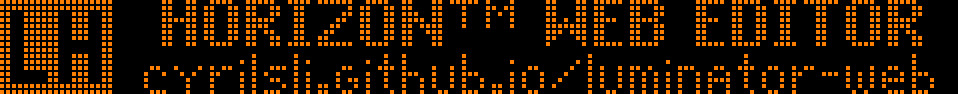

# Luminator Horizon Web Editor

A local web-based editor for transit destination signs, emulating the Luminator Horizon line of monochrome LED signs.

[](https://cyrilsli.github.io/luminator-web/?data=eJztz7sKwkAQheEZBQU7C0VBdCorL8-geAtEI4kg2K3JEhfHrOxGJW_pI4napkhh6Wn-8uNg9YnwXRnKdSy5K-gAVqGx8nzn4G2IiPbzKc1nzs7zoQ21ClCYGcWW1ShW6el2HCk95ttFJSLVZviQR3ABEUq7NSBgEyA_hcDWG-xtWWRkVZwMKBB3SUtnMaDgJIwkVsn5h97nYHfCTKxDwZyRTbWREfXpanQorZVRMe6f3LwAOaE-Rw)

## Features

- Each sign can have up to 8 screens ("slides"), each with up to 8 lines ("text boxes") of text.
- Signs can be played in sequence (click the main sign to enter fullscreen), exported as a GIF, and imported/exported using share links.
    - Share links can also be used to copy individual screens between signs.
    - **NOTE:** Please use share links to save your work instead of file import/export, as share links preserve all sign data.
    - TODO: Implement file import/export in the same format as share links.
- A custom font editor to display icons and other symbols, with data saved in the sign's share link or as a separate font share link.
- Sign sizes are the same as the Luminator Horizon line, in addition to a 88x31 size for web buttons (pixel size: 29x10).

## Build

1. Install `html-minifier-next`:

    ```bash
    sudo npm install -g html-minifier-next
    ```
2. Extract fonts from a `.ips` IPS project file using `mdb-export` (part of MDB Tools):

    ```bash
    mdb-export path/to/project.ips Fonts > data/fonts
    python scripts/extract_fonts.py data/fonts -c
    ```
3. Build the compressed HTML file:

    ```bash
    python scripts/build.py
    ```

`index.html` is the compressed, asynchronously loaded single-page web app, `index.dev.html` is the uncompressed, synchronous version for development, and `src/index.unmin.html` is the uncompressed, asynchronously loaded version for debugging.

This project is not affiliated with Luminator Technology Group, and is not intended for use with real Luminator signs or software. All trademarks and copyright belong to their respective owners.